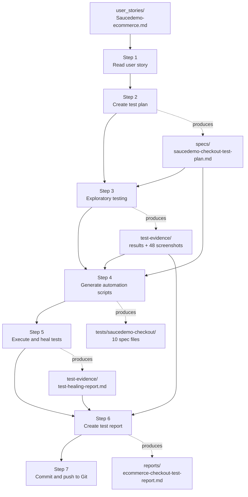
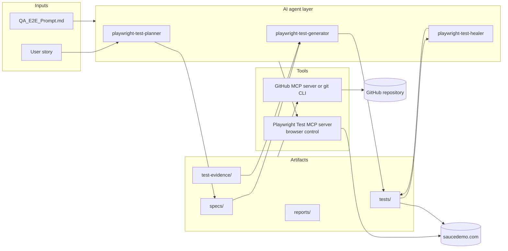

# AI-Agent End-to-End QA Workflow with Playwright

An end-to-end QA workflow driven by natural-language prompts. Starting from a single user story, an AI agent produces a test plan, executes exploratory tests, generates Playwright automation, heals failing scripts, writes a test report and commits everything to Git.

The application under test is the checkout process of [Saucedemo](https://www.saucedemo.com) (Swag Labs), a public demo e-commerce site.

| | |
|---|---|
| **User story** | SCRUM-101, Saucedemo-ecommerce Checkout Process |
| **Test cases** | 40, covering 5 acceptance criteria and 2 business rules |
| **Automation** | Playwright Test (JavaScript), Chrome only |
| **Latest result** | 32 passed, 8 failed on 6 real application defects |
| **Full report** | [reports/ecommerce-checkout-test-report.md](reports/ecommerce-checkout-test-report.md) |

## Contents

- [What this project demonstrates](#what-this-project-demonstrates)
- [The QA workflow](#the-qa-workflow)
- [Project architecture](#project-architecture)
- [Getting started](#getting-started)
- [Running the tests](#running-the-tests)
- [Test suite design](#test-suite-design)
- [Results and defects](#results-and-defects)
- [Re-running the workflow with an AI agent](#re-running-the-workflow-with-an-ai-agent)
- [Continuous integration](#continuous-integration)
- [Known limitations](#known-limitations)

## What this project demonstrates

A tester normally moves through requirements analysis, test design, manual execution, automation, maintenance, reporting and version control by hand. This project shows the same lifecycle run as seven prompts to an AI coding agent, with each step producing a file that the next step reads.

Two rules shape the result:

- **Tests assert what the user story requires, not what the application currently does.** When the application falls short, the test fails and a defect is logged.
- **Healing fixes scripts, never requirements.** A failing test is repaired only when the fault is in the script (selector, timing). Assertions are not weakened to hide an application bug.

## The QA workflow



| Step | What happens | Input | Output |
|---|---|---|---|
| **1. Read user story** | The story is summarised: requirements, acceptance criteria, application URL, credentials and scope. | [user_stories/Saucedemo-ecommerce.md](user_stories/Saucedemo-ecommerce.md) | Summary in chat |
| **2. Create test plan** | The live application is explored and a test plan is written with happy-path, negative, boundary, navigation and UI cases. Each case has an ID, the AC it covers, steps, expected results and test data. | User story, live application | [specs/saucedemo-checkout-test-plan.md](specs/saucedemo-checkout-test-plan.md) |
| **3. Exploratory testing** | Every test case is executed in Chrome at 1280x720. Results, screenshots, observations and reliable selectors are recorded. | Test plan | [test-evidence/exploratory-testing-results.md](test-evidence/exploratory-testing-results.md), [test-evidence/screenshots/](test-evidence/screenshots/) |
| **4. Generate automation** | Playwright scripts are written for every test case, using the selectors and UI behaviour confirmed in Step 3. | Test plan, exploratory results | [tests/saucedemo-checkout/](tests/saucedemo-checkout/), [playwright.config.js](playwright.config.js) |
| **5. Execute and heal** | The suite is run. Script faults are fixed (at most 3 attempts per test, then `test.fixme()`). Failures caused by application defects are kept and recorded. | Test scripts | [test-evidence/test-healing-report.md](test-evidence/test-healing-report.md) |
| **6. Create test report** | Manual results, automation results, healing activity, defects and coverage are compiled into one report. | Outputs of Steps 3 to 5 | [reports/ecommerce-checkout-test-report.md](reports/ecommerce-checkout-test-report.md) |
| **7. Commit to Git** | All artifacts are committed with a conventional-commit message and pushed. | Whole workspace | This repository |

The exact prompt for each step, and a single combined prompt for the whole workflow, are in [QA_E2E_Prompt.md](QA_E2E_Prompt.md).

## Project architecture

### Components



| Layer | Role | Where |
|---|---|---|
| **Inputs** | The user story defines what to test. The prompt file defines how the workflow runs. | [user_stories/](user_stories/), [QA_E2E_Prompt.md](QA_E2E_Prompt.md) |
| **AI agents** | Three agent definitions from Playwright: a planner, a generator and a healer. Each lists the browser tools it may use and its working method. | [.github/agents/](.github/agents/) |
| **MCP servers** | The Playwright Test MCP server lets an agent control a real browser. A GitHub MCP server, or the `git` CLI, handles the commit. | [.vscode/mcp.json](.vscode/mcp.json) |
| **Artifacts** | The plan, evidence, test scripts and report produced by the workflow. | [specs/](specs/), [test-evidence/](test-evidence/), [tests/](tests/), [reports/](reports/) |
| **Test runner** | Playwright Test executes the suite against the live site. | [playwright.config.js](playwright.config.js) |
| **CI** | GitHub Actions runs the suite on every push and pull request. | [.github/workflows/](.github/workflows/) |

### Folder structure

```
AI-AGENT-E2EQAWorkflow-Playwright/
├── .github/
│   ├── agents/                         AI agent definitions
│   │   ├── playwright-test-planner.agent.md
│   │   ├── playwright-test-generator.agent.md
│   │   └── playwright-test-healer.agent.md
│   └── workflows/
│       ├── playwright.yml              CI: run the tests on push and pull request
│       └── copilot-setup-steps.yml     Environment setup for the Copilot coding agent
├── .vscode/
│   └── mcp.json                        Playwright Test MCP server configuration
├── user_stories/
│   └── Saucedemo-ecommerce.md          Step 1 input: the user story
├── specs/
│   └── saucedemo-checkout-test-plan.md Step 2 output: 40 test cases
├── test-evidence/
│   ├── exploratory-testing-results.md  Step 3 output: manual results and findings
│   ├── test-healing-report.md          Step 5 output: run and healing results
│   └── screenshots/                    Step 3 output: 48 screenshots
├── tests/
│   └── saucedemo-checkout/             Step 4 output: automated tests
│       ├── helpers.js                  Shared data, setup steps and hooks
│       ├── tc-01-cart-review.spec.js
│       ├── tc-02-valid-checkout.spec.js
│       ├── tc-03-empty-validation.spec.js
│       ├── tc-04-invalid-checkout-data.spec.js
│       ├── tc-05-order-overview.spec.js
│       ├── tc-06-cancel-controls.spec.js
│       ├── tc-07-browser-back.spec.js
│       ├── tc-08-order-completion.spec.js
│       ├── tc-09-authentication-context.spec.js
│       └── tc-10-boundary-multi-item.spec.js
├── reports/
│   └── ecommerce-checkout-test-report.md  Step 6 output: test execution report
├── playwright.config.js                Test runner configuration
├── seed.spec.ts                        Seed file used by the Playwright agents
├── QA_E2E_Prompt.md                    The prompts for all seven steps
├── package.json
└── README.md
```

## Getting started

### Prerequisites

- [Node.js](https://nodejs.org), a current LTS release
- Google Chrome
- Git

### Installation

```bash
git clone https://github.com/Ramkumar-AL/AI-AGENT-E2EQAWorkflow-Playwright.git
cd AI-AGENT-E2EQAWorkflow-Playwright
npm install
```

The `chromium` project runs on the installed Google Chrome, so no separate browser download is needed when Chrome is present. To use Playwright's own browsers instead, run `npx playwright install`.

No credentials need to be configured. The suite uses Saucedemo's public demo account (`standard_user` / `secret_sauce`).

## Running the tests

| Purpose | Command |
|---|---|
| Run the whole suite | `npx playwright test tests/saucedemo-checkout --project=chromium` |
| Run with the line reporter | `npx playwright test tests/saucedemo-checkout --project=chromium --reporter=line` |
| Run the passing regression set only | `npx playwright test --grep-invert "@known-bug"` |
| Run the known-defect tests only | `npx playwright test --grep "@known-bug"` |
| Run one suite file | `npx playwright test tests/saucedemo-checkout/tc-01-cart-review.spec.js` |
| Run one test case | `npx playwright test -g "TC-30"` |
| Watch the browser | `npx playwright test --headed` |
| Debug step by step | `npx playwright test -g "TC-30" --debug` |
| Open the HTML report | `npx playwright show-report` |

A full run is expected to finish with **32 passed and 8 failed**. The 8 failures are the known application defects described below, not broken scripts.

## Test suite design

### Suites

| Suite file | Scope | Test cases |
|---|---|---|
| [tc-01-cart-review.spec.js](tests/saucedemo-checkout/tc-01-cart-review.spec.js) | Cart contents, total, UI elements, remove, reload | TC-01, TC-02, TC-04, TC-05, TC-06, TC-07 |
| [tc-02-valid-checkout.spec.js](tests/saucedemo-checkout/tc-02-valid-checkout.spec.js) | Information form, valid international data, end-to-end purchase | TC-10, TC-23, TC-30 |
| [tc-03-empty-validation.spec.js](tests/saucedemo-checkout/tc-03-empty-validation.spec.js) | Required-field errors and error presentation | TC-11 to TC-16 |
| [tc-04-invalid-checkout-data.spec.js](tests/saucedemo-checkout/tc-04-invalid-checkout-data.spec.js) | Whitespace, special characters, invalid postal codes, Enter key, script input | TC-18, TC-19, TC-20, TC-24, TC-25 |
| [tc-05-order-overview.spec.js](tests/saucedemo-checkout/tc-05-order-overview.spec.js) | Order summary, payment, shipping, totals, read-only items | TC-26, TC-28 |
| [tc-06-cancel-controls.spec.js](tests/saucedemo-checkout/tc-06-cancel-controls.spec.js) | Continue Shopping and both Cancel buttons | TC-03, TC-17, TC-29 |
| [tc-07-browser-back.spec.js](tests/saucedemo-checkout/tc-07-browser-back.spec.js) | Browser Back and Forward behaviour | TC-09, TC-38, TC-39, TC-40 |
| [tc-08-order-completion.spec.js](tests/saucedemo-checkout/tc-08-order-completion.spec.js) | Back Home and cart clearing after an order | TC-31, TC-32 |
| [tc-09-authentication-context.spec.js](tests/saucedemo-checkout/tc-09-authentication-context.spec.js) | Login rule and checkout step guards | TC-33 to TC-37 |
| [tc-10-boundary-multi-item.spec.js](tests/saucedemo-checkout/tc-10-boundary-multi-item.spec.js) | All six products, minimum and maximum input lengths | TC-08, TC-21, TC-22, TC-27 |

The `tc-NN` prefix in a file name is the suite number. It is separate from the test case IDs (TC-01 to TC-40) used in the test titles, the test plan and the report.

Each test title starts with its test case ID, and each step in the script is preceded by a comment with the matching step from the test plan, so plan, script and report can be traced to each other.

### Design decisions

- **Selectors:** Saucedemo exposes stable `data-test` attributes. The configuration sets `testIdAttribute: 'data-test'`, so scripts use `page.getByTestId()`.
- **Waits:** only web-first assertions such as `expect(locator).toHaveText()`. There are no fixed timeouts. Setup steps wait for page content as well as the URL, because the URL changes before the page renders.
- **Independence:** every test starts from a fresh browser context and performs its own setup through `beforeEach`, so tests can run in any order and in parallel.
- **Shared code:** [helpers.js](tests/saucedemo-checkout/helpers.js) holds the test data, the setup blocks from the test plan (login, cart, information, overview) and the `afterEach` hook that records the final URL when a test fails.
- **Data-driven cases:** one test per test case, with a `test.step` for each data row. Rejection cases use soft assertions so that every wrongly accepted row is reported.
- **Known defects:** tests that fail because of an application defect are tagged `@known-bug` and carry an `issue` annotation with the bug ID. They need no change once the defect is fixed.
- **Failure evidence:** a screenshot and a trace are kept for every failing test.

### Configuration

[playwright.config.js](playwright.config.js) defines one project, `chromium`, which runs on Google Chrome with a 1280x720 viewport, a base URL of `https://www.saucedemo.com`, 4 parallel workers and no retries.

## Results and defects

| Measure | Result |
|---|---|
| Test cases planned | 40 |
| Executed manually | 40 |
| Executed by automation | 40 |
| Passed | 32 |
| Failed | 8 |
| Blocked or skipped | 0 |

Manual and automated execution agreed on every test case. The 8 failures map to 6 defects:

| Bug | Severity | Defect | Test cases |
|---|---|---|---|
| BUG-01 | Medium | The cart page does not show a total price. | TC-02 |
| BUG-02 | High | Checkout information fields validate only for empty values. | TC-18, TC-19, TC-20 |
| BUG-03 | Medium | Pressing Enter in the information form cancels checkout. | TC-24 |
| BUG-04 | High | An order can be placed with an empty cart. | TC-36 |
| BUG-05 | High | The overview page opens without checkout information being entered. | TC-37 |
| BUG-06 | Medium | Browser Back after confirmation allows a second, empty order. | TC-40 |

Saucedemo is a demo site that is not expected to change, so these tests will keep failing. They are kept to show how the workflow separates application defects from script faults.

Steps to reproduce, screenshots and the coverage analysis are in the [test execution report](reports/ecommerce-checkout-test-report.md).

## Re-running the workflow with an AI agent

The workflow can be repeated for this story or adapted to another one.

1. **Open the project** in an editor with an AI coding agent that supports MCP servers, such as VS Code with GitHub Copilot or Claude Code.
2. **Start the Playwright Test MCP server.** It is already declared in [.vscode/mcp.json](.vscode/mcp.json) and runs `npx playwright run-test-mcp-server`.
3. **Connect a GitHub MCP server** if the agent should commit and push by itself. The `git` CLI works as a fallback.
4. **Run the prompts** from [QA_E2E_Prompt.md](QA_E2E_Prompt.md), one step at a time or as the single combined prompt at the end of that file.

To test a different feature, add a user story under [user_stories/](user_stories/) in the same format (description, URL, credentials, acceptance criteria) and change the file names in the prompts.

## Continuous integration

[.github/workflows/playwright.yml](.github/workflows/playwright.yml) runs `npx playwright test` on every push and pull request to `main`, and uploads the HTML report as a build artifact.

Because the 8 known-defect tests fail by design, the workflow reports a failed run. To make CI a regression gate, change its test command to:

```bash
npx playwright test --grep-invert "@known-bug"
```

## Known limitations

- **Scope:** Chrome only, one viewport size (1280x720) and one account (`standard_user`). Saucedemo's other accounts, such as `problem_user` and `locked_out_user`, are not covered.
- **Live dependency:** the tests run against the public Saucedemo site and need internet access. An outage or a change to the site will affect results.
- **How the committed artifacts were produced:** in the recorded run, the Playwright and GitHub MCP servers were not connected to the agent's session. The agent followed the three agent definitions directly, drove Chrome through Playwright scripts for the exploration and manual execution steps, and pushed with the `git` CLI. The manual results are therefore script-executed, as noted in the test report.
- **Validation rules:** the user story does not define valid formats for names and postal codes, so the AC5 tests use clearly invalid values only.
